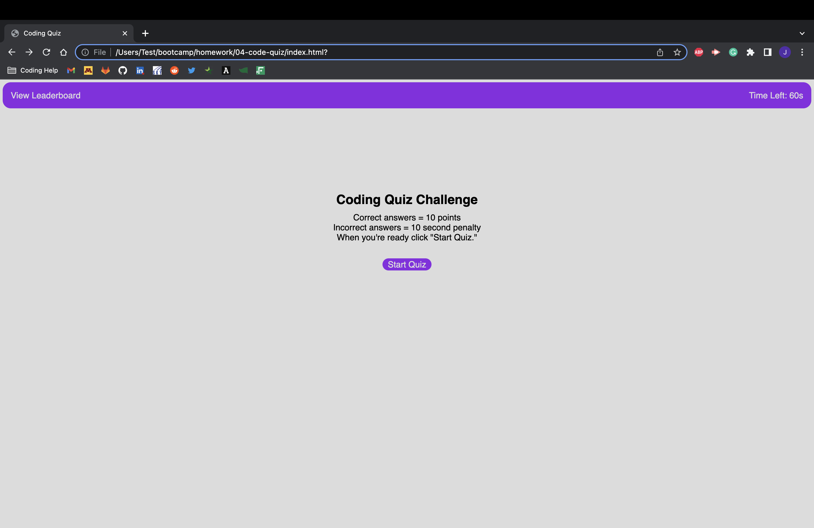
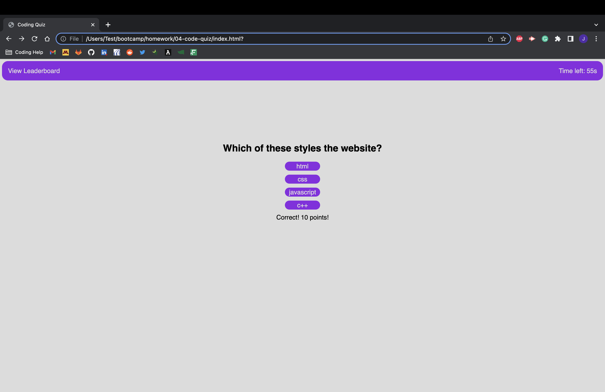
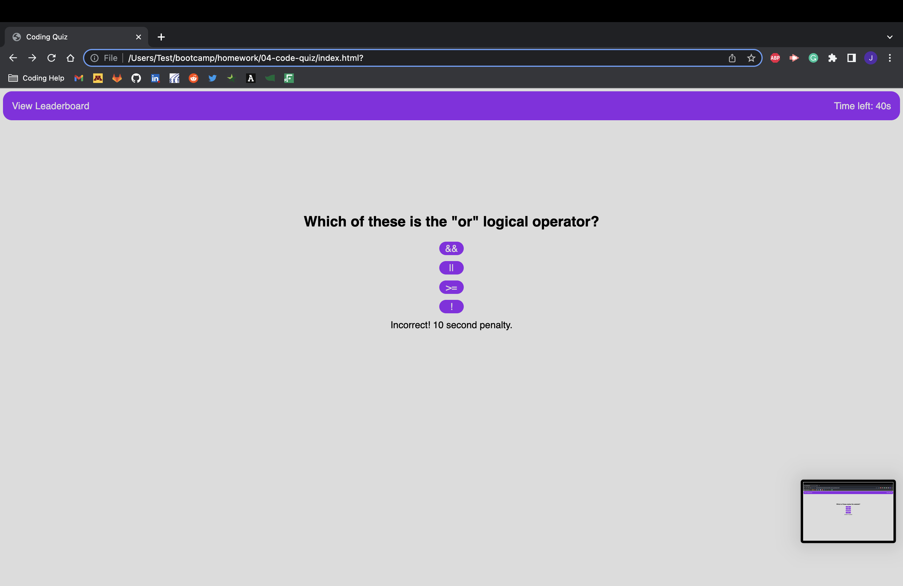
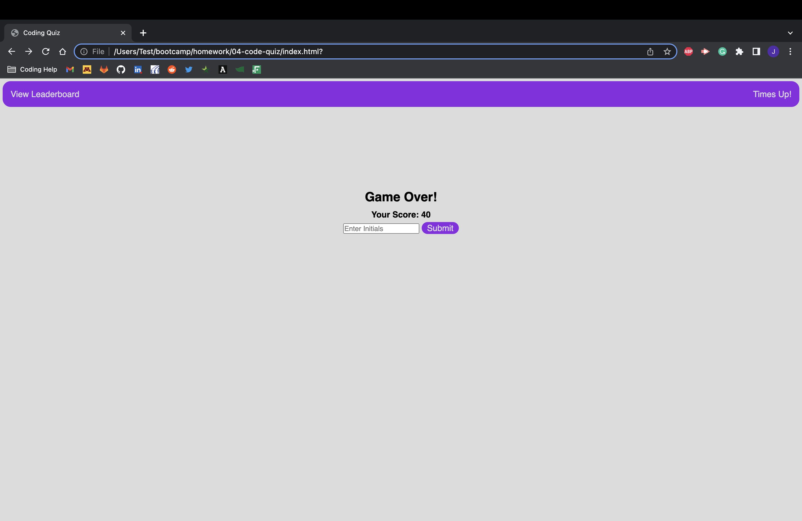
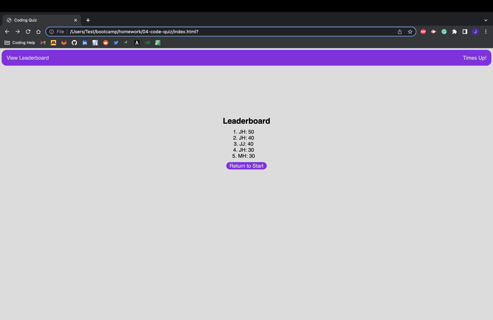

This assignment was to create a coding quiz using Javascript. 

When the user clicks the start button the quiz and timer start.
Everytime the user answers a question, a new question is presented.
When the user answers a question correctly they recieve 10 points.
When the user answers a question incorrectly, they lose 10 seconds.
When the timer runs out or the user answers all the questions the game is over.
When the game is over, they are asked for thier initials and they are added to a leaderboard.

https://jystyn.github.io/code-quiz/

